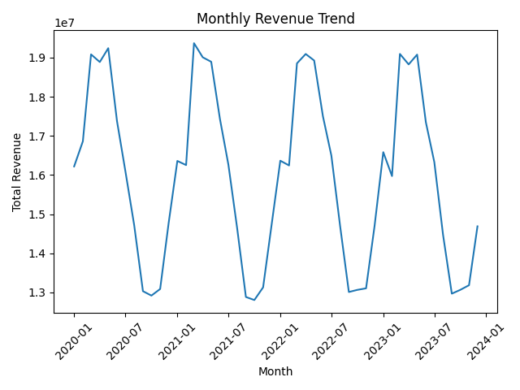
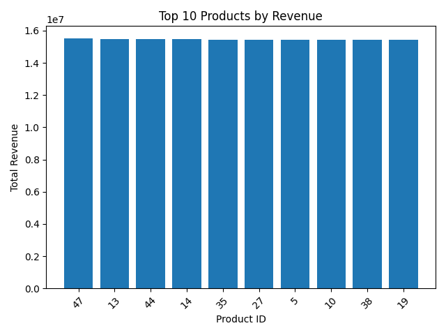
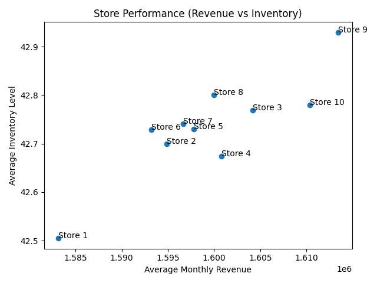
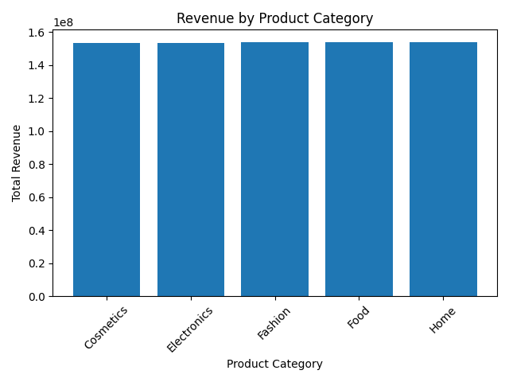
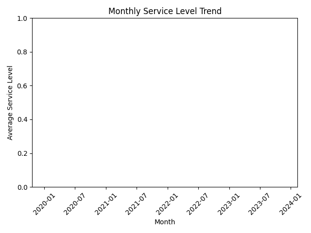

# Retail Sales & Inventory Analytics — France

I built this project as a hands‑on exercise to explore how multi‑year retail data can be transformed into insightful dashboards. The goal is to show what’s possible when you combine Python with Power BI and a bit of creative storytelling.

## Context

For this case study, I generated a realistic dataset of daily transactions across ten stores in France and fifty products spanning five categories. Each record captures:

* the **date**;
* the **store** (with its region and GPS coordinates);
* the **product** and its **category**;
* **units sold**, **unit price** and **revenue**;
* the **inventory level** at that point in time.

The data spans 1 January 2020 to 31 December 2023 — over 730 000 lines — so it behaves like real “big data” yet remains easy to explore.

## Key indicators

Several metrics help make sense of this data:

* **Total revenue** – Sum of units sold × price. This answers “How much did we sell?”
* **Units sold** – Count of products sold across all stores.
* **Average inventory** – Mean stock level, helpful to gauge how much capital is tied up.
* **Service level** – 1 − (stock‑out days ÷ days per month). A higher value indicates fewer stock‑outs.

### Comparisons and patterns

* **Sales trend:** Revenue varies month to month and follows seasonal patterns. The line chart below shows the overall revenue trend across four years. You can see peaks around the year‑end holidays and dips in the summer.
* **Top products:** Certain products and categories consistently outperform others. A simple bar chart reveals the top ten products by revenue.
* **Store performance:** When you scatter stores by average revenue vs. average inventory, you quickly spot which locations generate high sales with efficient stock levels.
* **Category mix:** Revenue share by category shows how much each product family contributes to total turnover.
* **Service level trend:** Tracking service levels over time highlights whether stock‑outs are improving or getting worse.

## Dataset

| File | Description |
|---|---|
| `data/raw/sales_data.csv` | Daily sales and inventory records for every product and store (four years). |
| `data/raw/store_locations.csv` | Lookup table with store name, region and geographic coordinates. |
| `data/raw/product_info.csv` | Lookup table with product ID and category. |
| `data/processed/sales_monthly.csv` | Monthly metrics by store: total units, revenue, average inventory and stock‑out days. |
| `data/processed/product_monthly.csv` | Monthly metrics by product: total units and revenue. |
| `data/processed/category_monthly.csv` | Monthly metrics by category: total units and revenue. |

All data is synthetic and created for educational purposes; it does not reflect any real company.

## Model and design

The report uses a simple star schema:

* **Calendar table:** A separate date table with year, quarter, month and day to enable flexible filtering.
* **Store and product dimensions:** Lookup tables enrich the fact table with names, categories, regions and coordinates.
* **Fact table:** The sales fact table aggregates daily transactions.

Several DAX measures compute KPIs, ratios and dynamic text used in the report.

## Dashboards

The following images are excerpts from the Power BI report built on this data. Each visual illustrates a different aspect of performance.

### Monthly revenue trend

### Top 10 products by revenue

### Store performance: revenue vs. inventory

### Revenue by product category

### Service level trend

Each visual interacts with slicers for time period, store, region and product. The report also includes dynamic narrative text that summarises key changes over time.

## Tools

* **Python (pandas, numpy, matplotlib)** – for data generation, cleaning and simple visualisation.
* **Power BI Desktop** – to transform the processed data, define measures in DAX and assemble the dashboards.
* **GitHub** – version control and collaboration.

This project demonstrates that even a synthetic dataset can tell a compelling story when paired with thoughtful analysis and design. Feel free to use it as a template for your own data adventures.